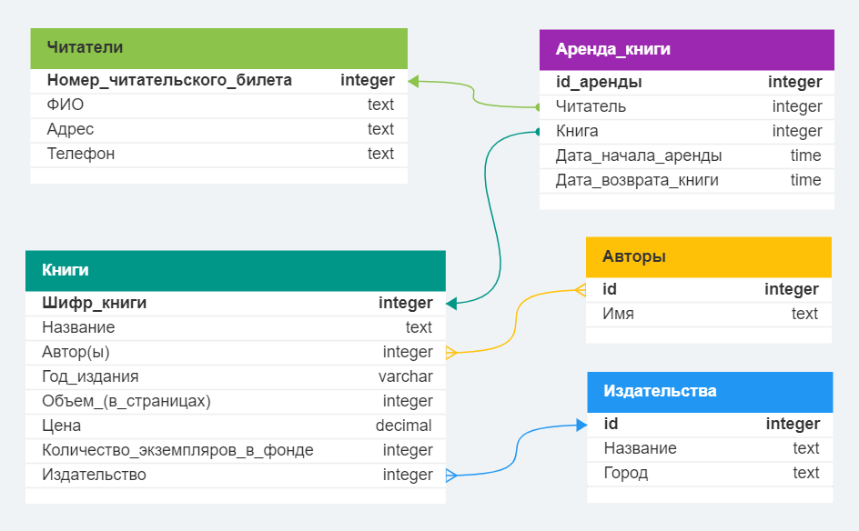

# Задание

### Разработать логическую структуру БД для создания "Библиотеки".

## Сущности в разрабатываемой БД "Библиотека", первичные и внешние ключи:

1. Читатели (№ читательского билета (PK), ФИО, адрес, телефон);
2. Авторы (id (PK), имя);
3. Издательства (id (PK), название, город);
4. Книги (Шифр книги (PK), название, авторы (FK id), год издания, объем (в страницах), цена, количество экземпляров в фонде, издательство (FK id));
5. Аренда книги (id аренды (PK), читатель (FK № читательского билета), книга (FK Шифр книги), дата начала аренды, дата возврата книги).

## Связи между сущностями
- У читателей может быть несколько книг в аренде, но одна книга может быть в аренде только у одного читателя: связь *один ко многим*;
- У одного автора может быть несколько книг и у одной книги может быть несколько авторов: связь *многие ко многим*;
- Издательство может печатать несколько (много) книг, но у 1 книги может быть только 1 издатель: связь *один ко многим*;
- Одну книгу можно сдать только в одну аренду (передать читателю), но читатель может взять почитать несколько книг: связь *один ко многим*.